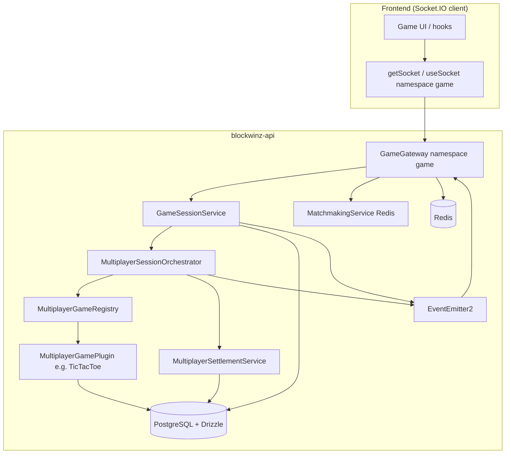

# Blockwinz multiplayer engine — technical reference

This document describes how the **core multiplayer stack** works end-to-end: transport, authentication, session storage, game-agnostic orchestration, per-title plugins, matchmaking, settlement, timers, and client integration. It reflects the code under `blockwinz-api/src/multiplayer/` and the Socket.IO client usage in the frontend (e.g. Tic Tac Toe).

---

## 1. Goals and design principles

- **Server authority**: Moves are validated and applied on the API; clients receive **public** state snapshots over WebSockets.
- **Game-agnostic core**: Lobby/session lifecycle, wallets, and realtime fan-out are shared. Each title implements a **`MultiplayerGamePlugin`** (registry pattern).
- **Horizontal scaling for matchmaking**: Quick match uses **Redis lists**, not in-memory queues.
- **Persistence + realtime**: PostgreSQL (via Drizzle) holds sessions and per-game rows; **NestJS `EventEmitter2`** bridges domain events to **Socket.IO** rooms.

---

## 2. Transport: Socket.IO and namespaces

| Piece | Detail |
|--------|--------|
| Library | **Socket.IO** (server + client) |
| Game namespace | `/game` — implemented by `GameGateway` (`@WebSocketGateway({ namespace: 'game', ... })`) |
| Transports | **WebSocket only** (`transports: ['websocket']`) on both server base gateway config and client (`blockwinz-FE/src/lib/socket.ts`) |
| CORS | `SOCKET_IO_CORS` shared constant |

The abstract `BaseGateway` also declares a root gateway with ping timeouts; the **multiplayer game logic** lives on the **`game`** namespace, not the default `/` namespace.

---

## 3. Connection authentication

Connections are protected by **`WsAuthGuard`** on `GameGateway`.

On connect, `BaseGateway.handleConnection`:

1. **Rate-limits** by IP (sliding window).
2. Extracts JWT from **`handshake.auth.token`** or **`Authorization: Bearer <token>`** header.
3. Verifies JWT with **`JWT_SECRET`** (same as HTTP API).
4. Loads the user from **`AuthenticationRepository`**.
5. Enforces **max connections per user** (default 5); may drop the oldest socket from Redis.
6. Stores **socket ↔ user** mappings in **Redis** (`SOCKET_USER_MAP`, `USER_SOCKET_MAP:<userId>`).
7. Optionally stores connection metadata (user-agent, IP).
8. Updates **online user** set (`ONLINE_USERS`).
9. Sets `client.data.user`, `client.data.userId`, `client.data.connectedAt`.
10. Emits **`user.connected`** (EventEmitter).

Failure emits an **`error`** event to the client and **disconnects** the socket.

The frontend (`getSocket(namespace, token)`) passes `{ auth: { token } }` so the server can authenticate without a separate HTTP upgrade.

---

## 4. High-level architecture



**Important**: `GameGateway` **subscribes** to internal events (`game.started`, `game.move`, etc.) in its constructor and **broadcasts** to Socket.IO rooms named `room:{sessionId}`. Clients must **join** that room to receive pushes; simply being connected to `/game` is not enough.

---

## 5. Core modules and files

| Area | Responsibility |
|------|----------------|
| `multiplayer/gateway/game.gateway.ts` | Socket.IO handlers (`newGame`, `gameAction`, `quickMatch`, `joinSessionRoom`, …) and event bridging to rooms |
| `multiplayer/gateway/gameGatewaySocketEvent.enum.ts` | Client event names (strings) |
| `multiplayer/game-session/game-session.service.ts` | CRUD for `game_sessions`, join/leave lobby, **JSON `gameAction`** parsing, reconnect grace fields |
| `multiplayer/orchestrator/multiplayer-session-orchestrator.service.ts` | Start match when lobby full, **submitMove**, **`handleTurnDeadline`** (forfeit / auto-move via plugin), **`applyReconnectGraceResolution`** (plugin-driven) |
| `multiplayer/plugins/multiplayer-game-plugin.interface.ts` | Plugin contract (`validateMove`, `applyMove`, **`resolveTurnTimeout`**, **`resolveReconnectGraceTimeout`**, `turnPolicy`, …) |
| `multiplayer/plugins/multiplayer-game-registry.service.ts` | Maps `DbGameSchema` → plugin instance |
| `multiplayer/plugins/tictactoe-multiplayer.plugin.ts` | Reference implementation for Tic Tac Toe |
| `multiplayer/matchmaking/matchmaking.service.ts` | Redis FIFO pairing for quick match |
| `multiplayer/game-session/listeners/match-found.listener.ts` | Creates DB session when `match.found` fires |
| `multiplayer/settlement/multiplayer-settlement.service.ts` | Idempotent wallet + history when a session ends |
| `multiplayer/players/player-session-tracker.service.ts` | In-memory + **Redis** (`mp:presence:*`) for cross-instance reconnect hints |
| `multiplayer/game-session/listeners/lobby-expiry.listener.ts` | Cancels stale **`pending`** lobbies (plugin `lobbyWaitMs` or **`MULTIPLAYER_LOBBY_MAX_WAIT_MS`**) |
| `multiplayer/players/listeners/afk.listener.ts` | Scheduled DB scans for turn deadlines and reconnect grace |
| `multiplayer/players/listeners/disconnection.listener.ts` | 15s in-memory timer → `game.cancelled` (metrics-oriented) |
| `gateways/base.gateway.ts` | Shared JWT auth, Redis connection tracking, rate limits |

---

## 6. Session model (`game_sessions`)

Defined in `src/database/schema/game-sessions.ts`. Notable columns:

| Field | Role |
|-------|------|
| `players` | UUID array — participants |
| `game_status` | `pending`, `in_progress`, `completed`, `cancelled` (`MultiplayerSessionStatus`) |
| `game_id` | After start, points to the **per-game row** (e.g. multiplayer Tic Tac Toe row id) |
| `bet_amount`, `currency`, `bet_amount_must_equal` | Stakes |
| `visibility`, `join_code_hash`, `invited_players` | Public vs private lobby, invite-only join |
| `turn_deadline_at` | Wall-clock deadline for **current turn** (used by AFK listener) |
| `reconnect_grace_until` | After disconnect, **grace window** for reconnect rules |
| `settled_at` | **Idempotency** for wallet settlement |

---

## 7. Plugin contract (`MultiplayerGamePlugin`)

Each multiplayer title implements:

- **`gameType`**, **`minPlayers`**, **`maxPlayers`**, **`supportedEntryModes`**
- **`turnPolicy`**: `turnMs`, `lobbyWaitMs`, `reconnectGraceMs`, `onTurnTimeout` (`forfeit` | `auto_move`)
- **`buildInitialState(ctx)`** — called inside a transaction when the game starts
- **`validateMove(ctx, state, userId, move)`** — returns `true` or a **reason string** (sent to client on invalid move)
- **`applyMove(...)`** — returns `newState`, `terminal`, optional `outcome` (`winnerUserIds`, `isDraw`, `metadata`)
- **`loadStateBySessionId` / `persistState`** — DB I/O
- **`toPublicView(state, viewerUserId?)`** — strip hidden info for clients (Tic Tac Toe returns full state as-is)

**Registry**: `MultiplayerGameRegistry` registers plugins in `onModuleInit()` (currently **Tic Tac Toe** only). `get()` throws if the game type is not registered; `tryGet()` returns `undefined`.

---

## 8. Session lifecycle

### 8.1 Lobby creation

- **`createSession`** (host): Inserts a row with `game_status = pending`, `players = [host]`, optional visibility/join code hash, etc. Rejects if the user already has an **active** session for that `gameType` (`pending` or `in_progress`).
- **`createMatchedSession`** (quick match): Inserts with **two players** already in `players`.

After insert, both paths call **`orchestrator.tryStartGameplay(sessionId)`**.

### 8.2 Starting gameplay (`tryStartGameplay`)

Runs only when:

- A plugin exists for `session.gameType`
- `game_id` is still null (not already started)
- `players.length >= plugin.minPlayers`
- `game_status === pending`

Inside a **DB transaction**:

1. If `bet > 0`, **`lockBetFunds`** for each player (wallet).
2. **`plugin.buildInitialState(ctx)`** → **`plugin.persistState`** (creates per-game row).
3. Reads `gameRowId` from persisted state (expects `id` on saved object).
4. Sets **`turn_deadline_at = now + turnPolicy.turnMs`**, clears `reconnect_grace_until`, sets **`game_status = in_progress`**, stores **`game_id`**.

After commit, emits **`game.started`** with `{ sessionId, gameId, state: plugin.toPublicView(state) }`.

### 8.3 Joining and leaving (lobby only)

- **`joinGame` / `joinGameWithCode`**: Appends user to `players`, emits `GAME_JOINED`, then **`tryStartGameplay`** again (may start the match when full).
- **Join validation (before append):** for new joiners (not already in `players`), **`GameSessionService`** calls **`WalletRepository.checkPlayerBalance`** for the lobby’s **`bet_amount`** and **`currency`**. Insufficient funds or unsupported currency fail with **`WsExceptionWithCode`** (HTTP-style errors are mapped so the socket client gets a clear message). This aligns lobby joins with the same stake the orchestrator will **`lockBetFunds`** when the match starts. The column **`bet_amount_must_equal`** is documented for strict table stakes; the join API does not yet accept a separate “incoming stake” field—until it does, all joiners must cover the full **`bet_amount`**.
- **`leaveGame`**: Only when `pending`; removes player or cancels session if empty.

### 8.4 Moves (`submitMove`)

Flow:

1. Load session — must exist and `in_progress`.
2. **`plugin.loadStateBySessionId`**.
3. **`validateMove`** — on failure emits **`game.invalidMove`** and throws (client gets error ack).
4. **`applyMove`** → **`persistState`**.
5. If not terminal: set **`turn_deadline_at = now + turnMs`**, clear **`reconnect_grace_until`**, emit **`game.move`** with `gameState: plugin.toPublicView(saved, userId)`.
6. If terminal: clear **`turn_deadline_at`**, run **`settlement.settleSession`** if `outcome` present, emit **`game.finished`**.

### 8.5 HTTP entry point for moves

Clients do **not** call `submitMove` directly by name on the wire. They send **`gameAction`** with a **stringified JSON** body:

```json
{ "action": "move", "sessionId": "<uuid>", "move": { "row": 0, "col": 1 } }
```

`GameSessionService.handleGameAction` parses JSON; for `move`, it normalizes `column` → `col` for convenience, then forwards to the orchestrator.

---

## 9. Matchmaking (quick match)

**`MatchmakingService.requestMatch`** builds a Redis key:

`mp:queue:{gameId}:{betAmount}:{currency}`

Algorithm:

1. **`rPop`** from the list — if another waiter exists and **is not the same user**, emit **`match.found`** with `{ player1, player2 }` and return `'matched'`.
2. Otherwise **`lPush`** self, **`expire`** queue (TTL 600s), return `'waiting'`.

**`MatchFoundListener`** (`@OnEvent('match.found')`) calls **`createMatchedSession`**, which starts gameplay if two players are ready.

**`cancelForUser`** scans `mp:queue:{gameId}:*` and removes entries for that user (best-effort).

---

## 10. Settlement (`MultiplayerSettlementService`)

`settleSession(session, outcome, finalState)`:

- Opens a transaction and reloads the session row.
- If **`settled_at` is already set**, returns (idempotent).
- **Draw**: releases locked bet funds for **all** players.
- **Single winner** (two players): releases both locks, **debits** loser, **credits** winner the total pot minus optional **rake** (`MULTIPLAYER_RAKE_BPS` / `MULTIPLAYER_RAKE_RECEIVER_USER_ID`); rake defaults to **0** (full `bet * 2` to winner).
- Sets **`settled_at`**, **`game_status = completed`**.
- **`GameHistoryService.saveGameResult`** with moves from `finalState.moveHistory` when present.
- Emits **`multiplayer.session.settled`**.

Wallet operations go through **`WalletRepository`**.

---

## 11. Timeouts, AFK, and disconnect handling

### 11.1 Turn deadline (`turn_deadline_at`)

**`AfkListener.checkTurnDeadlines`** (every 5s) selects sessions where `turn_deadline_at < now` and `in_progress`, then calls **`orchestrator.handleTurnDeadline`**, which delegates to **`plugin.resolveTurnTimeout`** (**forfeit** or **auto_move** per plugin policy), then persists, settles if terminal, and emits **`game.move`** or **`game.finished`**.

### 11.2 Socket disconnect and DB grace (`reconnect_grace_until`)

On **`GameGateway.handleDisconnect`**:

1. **`super.handleDisconnect`** (BaseGateway — Redis cleanup, `user.disconnected`).
2. **`playerSessionTracker.markDisconnected(userId)`** — marks in-memory state and emits **`player.disconnected`** `{ playerId, sessionId }` if the user was tracked in a session.
3. **`gameSessionService.handleUserDisconnect(userId)`** — finds an **in_progress** session containing that user and sets **`reconnect_grace_until = now + plugin.turnPolicy.reconnectGraceMs`** (default **120s** for Tic Tac Toe if plugin missing).

**`AfkListener.checkReconnectGraceExpiry`** (every 5s) selects sessions where **`reconnect_grace_until` has passed** and calls **`applyReconnectGraceResolution`**.

**`applyReconnectGraceResolution`** calls **`plugin.resolveReconnectGraceTimeout`** with connection snapshots (in-memory + Redis-backed **`getPlayerStatus`**). Tic Tac Toe implements draw (both disconnected), forfeit (one disconnected), or **`null`** if both are back online (clears grace only).

When a player **joins the session room** (`joinSessionRoom`), the server:

- Verifies membership in `players`,
- **`socket.join(`room:${sessionId}`]`**,
- **`markConnected`** on tracker,
- **`disconnectionListener.clearTimeoutForPlayer`** (see below),
- **`clearReconnectGrace`** in DB.

### 11.3 In-memory AFK hint (`player.afk`)

**`AfkListener.checkForAfkPlayers`** (every 10s) scans tracker states; if **`connected && now - lastActive > 30s`**, emits **`player.afk`**. This is **not** the authoritative forfeit timer (the DB **`turn_deadline_at`** is).

### 11.4 `DisconnectionListener` (15s timer)

On **`player.disconnected`**, starts a **15s** timeout. If not cleared, emits **`game.cancelled`** (used by **`GameMetricsCollector`** for `logGameAbandoned`). **`joinSessionRoom`** clears this timer when the user reconnects to the room.

This path is **separate** from DB **`reconnect_grace_until`** resolution (longer, game-specific). Do not assume they cancel the same session.

---

## 12. Anti-cheat and metrics

- **`MoveMadeListener`** (`@OnEvent('game.move')`): If `move.timestamp` exists and the move is “too fast” (<200ms vs server time), logs via **`AntiCheatService`** (`fast-move`). Comment notes future collusion / repeated matchup checks.
- **`GameMetricsCollector`**: On **`game.finished`** logs win/played; on **`game.cancelled`** logs abandoned.
- **`GameFinishedListener`**: Logs **`game.finished`**; documents that settlement is **not** here.

---

## 13. Socket.IO API surface (client → server)

| Event (string) | Purpose |
|----------------|---------|
| `getActiveGame` | `{ gameType }` — returns pending/in-progress session; if in progress, attaches **`gameState`** from plugin public view |
| `newGame` | Create lobby (`CreateSessionPayload`-shaped body) |
| `gameAction` | Legacy **`{ message: string }`** (stringified JSON) or structured **`{ action, sessionId, move }`** |
| `quickMatch` | `{ gameId, betAmount, currency }` — may **`join`** an existing public lobby first; success can be **`{ status: 'joined', session }`** or **`{ status: 'waiting' \| 'matched' }`** |
| `listPublicLobbies` | `{ gameType }` |
| `joinGame` | `{ gameId, joinCode?, betAmount?, currency? }` — when **`bet_amount_must_equal`**, **`betAmount`** and **`currency`** are required |
| `leaveGame` | `{ gameId }` |
| `joinSessionRoom` | `{ sessionId }` — join Socket.IO room `room:{sessionId}` |
| `leaveSessionRoom` | `{ sessionId }` |
| `joinLobbyRoom` | `{ gameType }` — subscribe to **`lobbies:{gameType}`** for **`lobby.updated` / `lobby.expired`** |
| `leaveLobbyRoom` | `{ gameType }` |
| `joinSpectatorSession` | `{ sessionId }` — when session allows spectators |

Responses use **`WsResponse`** shape: `{ success, code, data, message, timestamp }`.

---

## 14. Server → client pushes (room broadcasts)

Subscribed in `GameGateway` constructor and emitted to **`room:{sessionId}`** (and **`lobbies:{gameType}`** where noted):

| Event | Typical payload |
|-------|-----------------|
| `game.started` | `sessionId`, `gameId`, `state` |
| `game.move` | `sessionId`, `playerId`, `move`, `gameState` |
| `game.invalidMove` | `sessionId`, `playerId`, `reason` |
| `game.finished` | `sessionId`, `winner`, `finalState` |
| `player.afk` | `playerId`, `sessionId` |
| `player.disconnected` | `playerId`, `sessionId` |
| `match.ready` | `sessionId`, `gameType` — sent to matched users’ socket ids (quick match) |
| `lobby.updated` | `gameType`, `reason`, `sessionId`, `session` — to **`lobbies:{gameType}`** |
| `lobby.expired` | `sessionId`, `gameType` — to **`lobbies:{gameType}`** |

Errors for failed handlers may also emit **`gameError`** to the client socket.

---

## 15. Frontend integration (Tic Tac Toe example)

- **`useSocket('game')`** (or equivalent) with JWT — connects to **`SERVER_BASE_URL/game`**.
- **`useMultiplayerTictactoe`** (`blockwinz-FE/src/casinoGames/tictactoes/hooks/useMultiplayerTictactoe.ts`):
  - Uses **`emitAck`** for request/response events.
  - **`joinSessionRoom(sessionId)`** after the user has a session.
  - Listens for **`game.started`**, **`game.move`**, **`game.invalidMove`**, **`game.finished`** on the socket.
  - Sends moves via **`gameAction`** (stringified JSON **`message`** or structured body). When joining lobbies with **`bet_amount_must_equal`**, send **`betAmount`** and **`currency`** on **`joinGame`**. Listen for **`match.ready`** after quick match; use **`joinLobbyRoom`** + **`lobby.updated`** for lobby lists.

---

## 16. Extending the engine (new game type)

1. Add **`DbGameSchema`** entry in shared package if needed.
2. Implement **`MultiplayerGamePlugin`** (rules, persistence table, `turnPolicy`).
3. Register in **`MultiplayerGameRegistry.onModuleInit`**.
4. Implement **`resolveTurnTimeout`** and **`resolveReconnectGraceTimeout`** on the plugin for game-specific timeout and disconnect handling (orchestrator stays game-agnostic).
5. Extend **`handleGameAction`** if the wire protocol needs new `action` types beyond `move`.

---

## 17. Summary

The multiplayer “engine” is a **layered pipeline**: **Socket.IO + JWT** for transport, **`game_sessions` + per-game tables** for truth, a **plugin** for rules and persistence, **`MultiplayerSessionOrchestrator`** for moves and terminal outcomes, **Redis** for quick-match queues and connection maps, **`EventEmitter2`** for decoupled **domain events**, and **`GameGateway`** for **room-based** realtime broadcasts. Clients must **join `room:{sessionId}`** to observe match events; moves are submitted via **`gameAction`** JSON and validated by the plugin on every turn.

---

## 18. Alignment: backend capability vs UX expectations

The stack is **architecturally strong** (plugins, orchestrator, Redis matchmaking, **`settled_at`** idempotency, room fan-out). Remaining confusion is often **gaps between what the API can do and what the client exposes**, plus a few **validation and lifecycle** items.

### 18.1 Implemented alignment (see plan: multiplayer engine gap closure)

| Area | Notes |
|------|--------|
| **Join + wallet** | **`joinGame`** checks **`checkPlayerBalance`** for the lobby stake; optional **`betAmount` / `currency`** on join must match when **`bet_amount_must_equal`** is true. **`tryStartGameplay`** failure after join **rolls back** the joiner from **`players`**. |
| **Host / matched session** | **`createSession`** validates host balance when **`betAmount > 0`**. **`createMatchedSession`** validates both players; on **`tryStartGameplay`** failure the inserted row is **deleted**. |
| **Quick match** | **`tryJoinOrEnqueueQuickMatch`** tries **`findJoinablePublicLobby`** (same game, bet, currency, not full) before Redis queue; response may be **`joined`** with **`session`**. |
| **Plugins** | **`resolveTurnTimeout`** / **`resolveReconnectGraceTimeout`** on **`MultiplayerGamePlugin`**; orchestrator delegates; Tic Tac Toe holds the concrete rules. **`onTurnTimeout: 'auto_move'`** picks the first empty cell. |
| **Lobby TTL** | **`LobbyExpiryListener`** cancels stale **`pending`** sessions; emits **`lobby.expired`** / **`lobby.updated`**. |
| **`gameAction`** | Accepts legacy stringified JSON **`message`** or a structured object **`{ action, sessionId, move }`**. |
| **Realtime UX** | **`match.ready`** emitted to online user sockets after **`createMatchedSession`**; **`lobby.updated`** / **`lobby.expired`** broadcast to **`lobbies:{gameType}`** (clients use **`joinLobbyRoom`**). |
| **Settlement** | Optional **rake**: **`MULTIPLAYER_RAKE_BPS`**, **`MULTIPLAYER_RAKE_RECEIVER_USER_ID`**. |
| **Presence** | **`PlayerSessionTrackerService`** mirrors presence to Redis **`mp:presence:{userId}`** (TTL); **`getPlayerStatus`** falls back to Redis for cross-instance reconnect resolution. |
| **Spectators** | **`joinSpectatorSession`** joins **`room:{sessionId}`** when **`spectators_allowed`** or user is in **`spectator_user_ids`**. |

### 18.2 Optional follow-ups

| Idea | Notes |
|------|--------|
| **Countdown before start** | Emit **`game.starting`** / delay **`tryStartGameplay`** (not implemented). |
| **Dedicated spectator channel** | Separate Socket.IO room from players if you need stricter isolation. |

Environment (see **`blockwinz-api/.env.example`**): **`MULTIPLAYER_LOBBY_MAX_WAIT_MS`**, **`MULTIPLAYER_RAKE_BPS`**, **`MULTIPLAYER_RAKE_RECEIVER_USER_ID`**.

### 18.3 Frontend note

The web client should **mirror intents** (quick match, browse lobbies, create, join by code) so users see one mental model. Backend fixes above **complement** that UX; they do not replace clear **tabbed flows** and visible stakes on the client.
